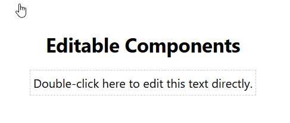

# mantine-double-click-editable

A double-click-to-edit text component for [Mantine](https://mantine.dev/), with precise caret placement.

[](https://www.npmjs.com/package/mantine-double-click-editable)
[](https://github.com/ypyl/DoubleClickEditable)

## Demo



## Installation

```bash
npm install mantine-double-click-editable
# or
yarn add mantine-double-click-editable
```

## Peer Dependencies

Ensure you have `@mantine/core`, `@mantine/hooks`, `react`, and `react-dom` installed in your project.

## Usage

```tsx
import { DoubleClickEditable } from 'mantine-double-click-editable';
import '@mantine/core/styles.css';

function MyComponent() {
  return (
    <DoubleClickEditable
      onSave={(content) => console.log('Saved:', content)}
      c="blue"
      fw={700}
    >
      Double-click to edit me!
    </DoubleClickEditable>
  );
}
```

## Features

- **Double-click to edit:** Seamlessly transition between view and edit modes.
- **Precise Caret Placement:** The cursor is placed exactly where you double-click, even in the middle of text.
- **Mantine Integration:** Inherits all props from Mantine's `Text` component.
- **TypeScript Support:** Fully typed out of the box.

## License

MIT
